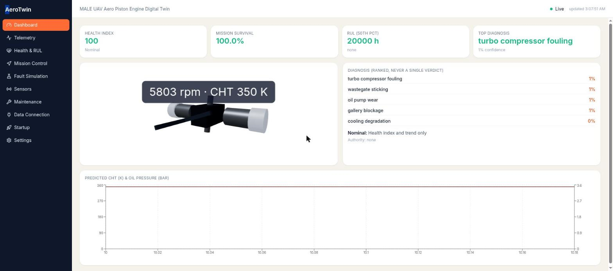
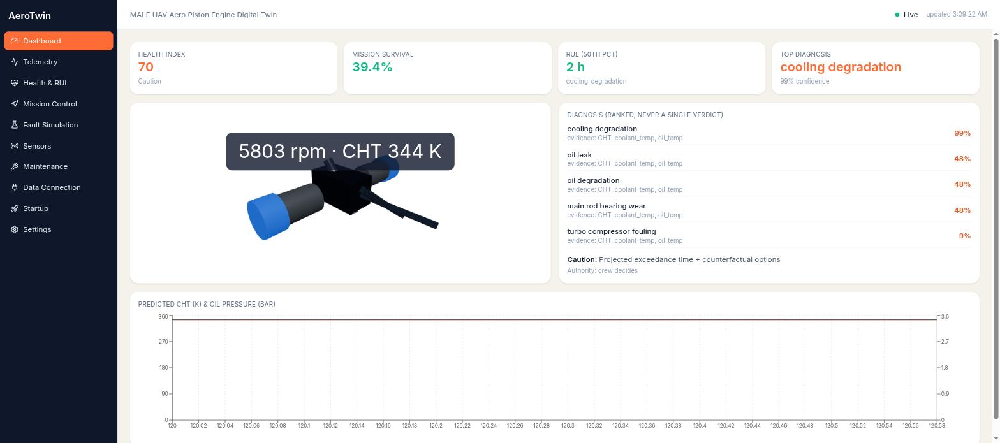
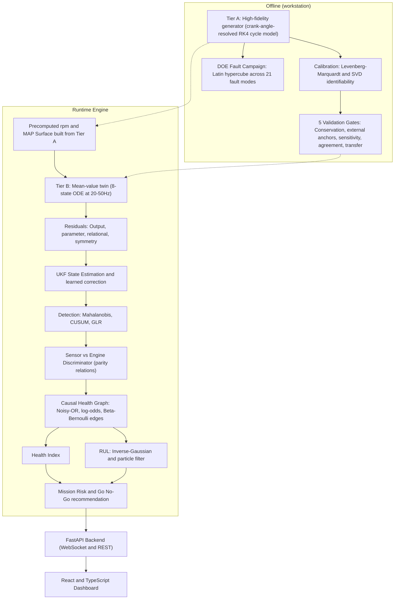
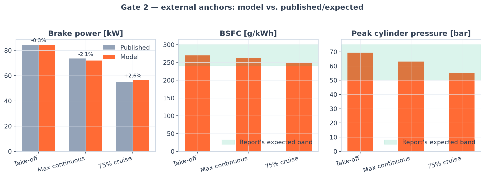
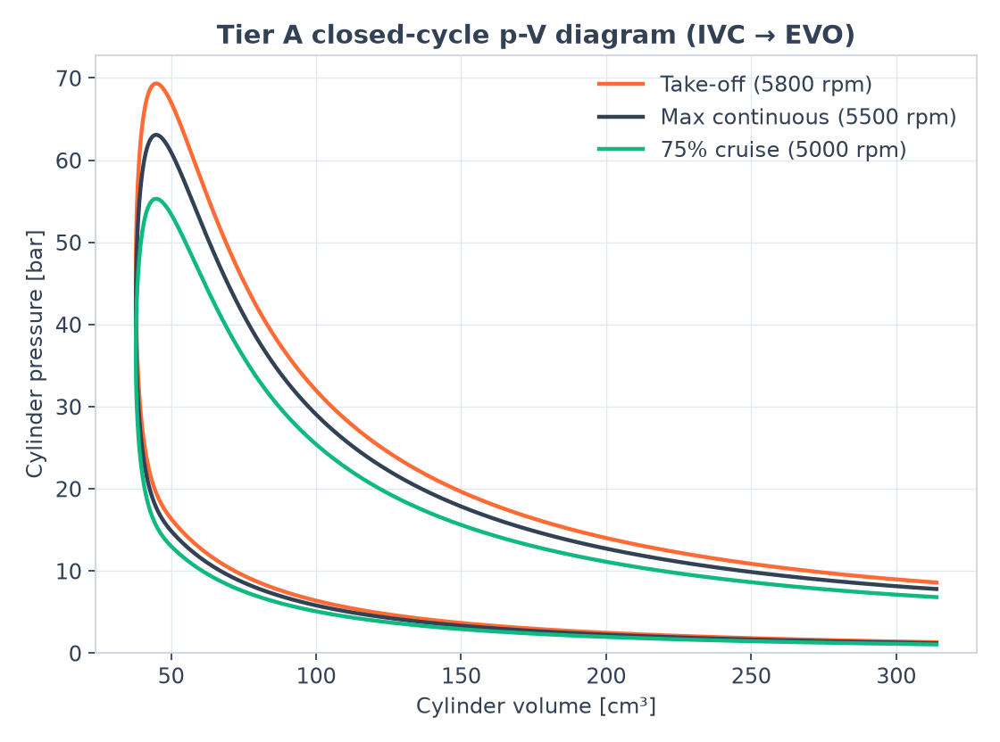
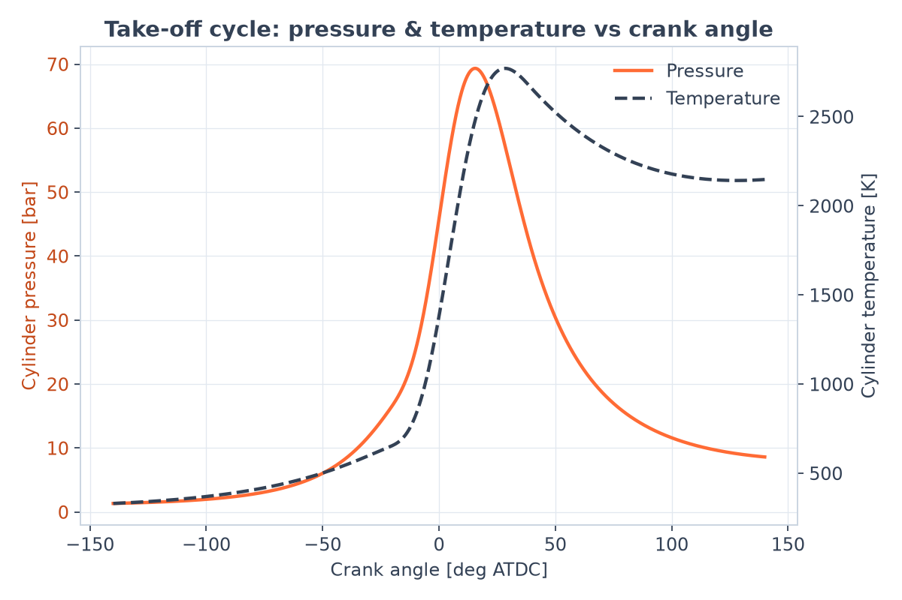
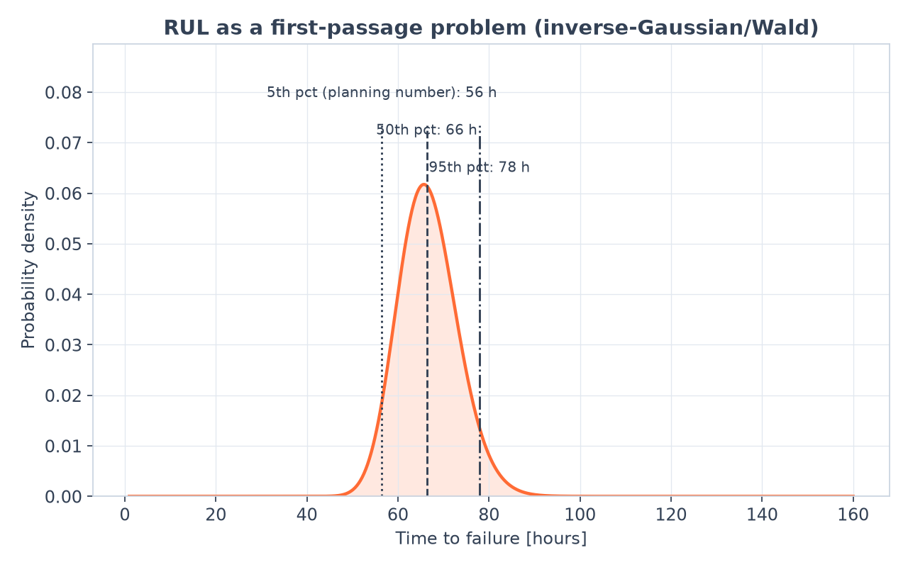
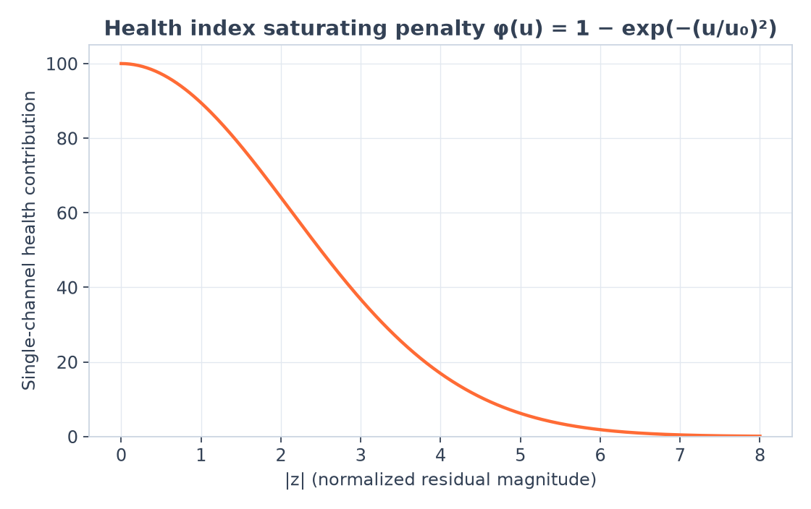

<div align="center">

# Celestia (SIH26054)

### A physics-grounded digital twin for a MALE-UAV aero piston engine

*Crank-angle-resolved combustion physics → a real-time mean-value twin → UKF state estimation →
fault detection & diagnosis → a causal health graph → remaining-useful-life & mission-risk
estimation → a FastAPI backend → a React/TypeScript dashboard.*


</div>

---

## What this is

Every number on this dashboard is produced by an actual simulation, not a
mock. A crank-angle-resolved thermodynamic cycle model (**Tier A**) is
calibrated against a Rotax-914-class engine's three published power ratings
to a fraction of a percent; a real-time mean-value ODE twin (**Tier B**),
built from Tier A's own precomputed surfaces, drives a live FastAPI backend
and a strict-TypeScript React dashboard over a WebSocket. On top of the twin
sits a full condition-monitoring stack — residual generation, an Unscented
Kalman Filter, CUSUM/GLR/Mahalanobis fault detection, sensor-vs-engine
discrimination via parity relations, a causal health graph, a health index,
a remaining-useful-life estimator (first-passage / inverse-Gaussian +
particle filter), and a mission-risk/go-no-go classifier — all with the
same hard constraint the source report specifies: **the system only ever
recommends; it never commands an actuator.**

Built phase-by-phase from [`docs/BUILD_ROADMAP.md`](docs/BUILD_ROADMAP.md),
itself derived from a 29-section technical report (kept local-only, not
part of this repo's history — see the roadmap's own appendices for every
equation and constant transcribed out of it).

## Contents

- [Screenshots](#screenshots)
- [Architecture](#architecture)
- [Validation — does the physics actually hold up?](#validation--does-the-physics-actually-hold-up)
- [What's built (by phase)](#whats-built-by-phase)
- [Quick start](#quick-start)
- [Project layout](#project-layout)
- [Testing](#testing)
- [Tech stack](#tech-stack)
- [Honest limitations](#honest-limitations)
- [Documentation](#documentation)

---

## Screenshots

The frontend has no mock-data mode — both of these are the real dashboard,
driven by the real backend pipeline, over a live WebSocket.

<table>
<tr>
<td width="50%" align="center"><b>Healthy steady state</b></td>
<td width="50%" align="center"><b>A cooling-degradation fault, detected & diagnosed</b></td>
</tr>
<tr>
<td></td>
<td></td>
</tr>
</table>

Health index 100 → 70, mission survival 100% → 39%, tier Nominal → Caution,
and the ranked diagnosis (never a single verdict) correctly names
`cooling_degradation` at 99% confidence with its supporting evidence — all
from one injected fault, propagating through the real pipeline in real
time. Note the 3D twin's cylinder head stays cool in the second screenshot:
it renders the **twin's own belief** (predicted CHT, which hasn't caught up
yet), while the diagnosis panel is driven by the **residual** between that
belief and the measured value — which is the entire point of a
residual-based monitoring system.

## Architecture



The pipeline itself is a fixed chain of typed contracts
(`simengine/twin/contracts.py`) — every stage below is independently
testable and swappable:


## Validation — does the physics actually hold up?

<table>
<tr>
<td width="50%">

**Gate 1 — Conservation.** Chemical heat release must equal indicated work
plus wall heat loss plus the change in trapped-gas internal energy, to
within 0.5% of fuel energy per the source report. Measured: **0.00008%** —
four orders of magnitude inside the gate.

**Gate 2 — External anchors.** The model reproduces the engine's three
published power ratings without ever having fitted anything except those
three numbers:

| Rating | Model | Published | Error |
|---|---|---|---|
| Take-off | 84.27 kW | 84.5 kW | **−0.27%** |
| Max continuous | 71.98 kW | 73.5 kW | **−2.06%** |
| 75% cruise | 56.52 kW | 55.1 kW | **+2.57%** |

Peak cylinder pressure and BSFC — never in the fit — land inside the
report's expected bands at every point (see chart).

</td>
<td width="50%">

</td>
</tr>
</table>

**Gate 3 — Sensitivity sanity.** For 18 of the 21 named failure modes in
the fault library, perturbing the declared parameter moves the predicted
"first mover" sensor channel in the documented direction. The remaining 3
are `pytest.skip`-marked with the specific missing capability (a
volumetric-efficiency surface, a wastegate controller, an intercooler
model), never silently passed.

**Gate 4 — Cross-model agreement.** Tier B (mean-value) tracks Tier A
(crank-resolved) within the report's stated tolerances at a matched
operating point: MAP within 1%, crank speed within 0.5%, CHT within 3K.

**Gate 5 — External dataset transfer.** Scaffolded and documented; skipped
because no public bearing-fault dataset ships with this repo (see
`simengine/validation/gate5_external_dataset_transfer.py` for how to add
one).

<table>
<tr>
<td width="25%"></td>
<td width="25%"></td>
<td width="25%"></td>
<td width="25%"></td>
</tr>
<tr>
<td align="center"><sub>Tier A indicator diagram</sub></td>
<td align="center"><sub>Take-off cycle vs crank angle</sub></td>
<td align="center"><sub>RUL: closed-form first-passage</sub></td>
<td align="center"><sub>Health index's saturating penalty</sub></td>
</tr>
</table>

## What's built (by phase)

Every phase below is committed separately with its own tests — see `git log`
for the full history and each commit message for what was learned building it.

| # | Phase | Highlights |
|---|---|---|
| 0–1 | Scaffolding, geometry, thermo, RK4 solver | Slider-crank kinematics, gas properties, the crank-angle integrator everything else reuses |
| 2–8 | Combustion → degradation | Wiebe heat release, Woschni heat transfer, universal orifice flow, turbocharging, Chen-Flynn friction, lubrication/tribology, vibration order synthesis, Archard/Arrhenius/Paris-Miner degradation |
| 9 | Calibration | Levenberg-Marquardt + SVD identifiability; reproduces the report's own "weak-prior lets combustion efficiency exceed 1.0" cautionary tale |
| 10 | Validation gates | All five report gates, automated |
| 11 | Fault injection | Severity-shape generators + Latin-hypercube DOE campaign across 21 fault modes |
| 12 | Sensor/bus emulation | Lag, noise, bias, drift, quantization, dropout, freeze, gain error; CAN-like framing |
| 13 | Tier B twin | 8-state real-time ODE, cross-validated against Tier A |
| 14 | Estimation | Residuals (4 dimensions) + a from-scratch UKF over the augmented [state; health-parameter] vector |
| 15 | Detection & discrimination | Mahalanobis/CUSUM/GLR + parity-space sensor-vs-engine discrimination |
| 16 | Diagnosis & prognosis | Causal health graph, health index, RUL (closed-form + particle filter), mission risk |
| 17 | Backend | FastAPI service, typed pipeline contracts, WebSocket broadcast |
| 18 | Frontend | Strict TypeScript, dynamic lazy-loaded modules, a live 3D twin |
| 19 | Integration | End-to-end campaign evaluation, all gates re-confirmed, demo docs |

## Quick start

**One command** (sets up `.venv` and `frontend/node_modules` on first run if
they don't exist yet, then runs both together; `Ctrl+C` stops both):

```bash
./start.sh
# -> backend:  http://127.0.0.1:8000  (health: /api/health, docs: /docs)
# -> frontend: http://127.0.0.1:5173
```

Override ports/hosts via env vars if needed:
`BACKEND_PORT=8001 FRONTEND_PORT=5174 ./start.sh`.

<details>
<summary>Or run each piece by hand</summary>

```bash
# 1. Python environment (simengine + backend)
uv venv .venv
uv pip install --python .venv -e ".[dev,backend]"

# 2. Run the backend
.venv/bin/uvicorn backend.app.main:app --reload
# -> http://localhost:8000  (health: /api/health, docs: /docs)

# 3. Run the frontend (separate terminal)
cd frontend
npm install
npm run dev
# -> http://localhost:5173
```

</details>

See [`docs/DEMO_SCRIPT.md`](docs/DEMO_SCRIPT.md) for a guided walkthrough,
including the exact `curl` command used to produce the fault-detected
screenshot above.

## Project layout

```
simengine/    Python physics/estimation/diagnosis engine (Phases 0-16)
  engine/       geometry, thermo, combustion, heat, flow, turbo, friction,
                dynamics, lube, vibration, degradation, solver, cycle
  faults/       fault library, severity injector, DOE campaign generator
  sensors/      corruption-stage emulation, CAN-like bus framing
  calibration/  Levenberg-Marquardt fit + SVD identifiability
  validation/   the 5 report validation gates
  twin/         contracts, mean-value twin, residuals, UKF, detection,
                discriminator, causal graph, health index, RUL, mission risk
  config/       engine_seed_params.yaml, fault_library.yaml
backend/      FastAPI service wiring simengine into one pipeline (Phase 17)
frontend/     React + strict TypeScript dashboard (Phase 18)
docs/         BUILD_ROADMAP.md (phase-by-phase spec), DEMO_SCRIPT.md, assets/
research/     local-only reference report (not tracked in this repo)
```

## Testing

```bash
.venv/bin/pytest simengine/ backend/ -q
# 210 passed, 3 skipped
```

Covers the physics core, calibration, all five validation gates, fault
injection, sensor emulation, the real-time twin, state
estimation/detection/diagnosis, the causal graph/health index/RUL/mission
risk, and the backend pipeline/API — including a small end-to-end campaign
evaluation that runs synthetic missions through the real pipeline and checks
top-1 diagnosis accuracy against the injected fault's true label.

```bash
cd frontend && npx tsc --noEmit && npm run build   # strict TS, zero errors
```

## Tech stack

| Layer | Stack |
|---|---|
| Physics/estimation | Python 3.14, NumPy, SciPy, Pydantic v2 |
| Backend | FastAPI, Uvicorn (WebSocket + REST) |
| Frontend | React 19, strict TypeScript, Vite, Tailwind, Zustand, react-three-fiber/drei, Recharts |
| Testing | pytest, TestClient (httpx2), tsc |

## Honest limitations

This project documents what's real vs. simplified in-line rather than
overclaiming. A few load-bearing examples (see each module's own docstring
for the rest):

- Only **2 of the 21** physical fault modes (`cooling_degradation`,
  `oil_pump_wear`) have a verified theta hook driving them through the live
  Tier B twin end-to-end today; the other 6 wired into the causal graph
  have first-mover channels but no corresponding twin parameter yet, and 13
  more need capabilities (per-cylinder EGT, vibration features, knock,
  fuel-rail pressure) Tier B doesn't model at all.
- The turbo shaft uses a quasi-steady relaxation, not the literal (and
  numerically stiff) inertial ODE from the source report.
- Residual context-surfaces use fixed placeholder sigmas, not ones fit from
  real or campaign-generated confirmed-normal telemetry.
- Only 10 of the frontend's routed pages have real content; the rest
  (Sensors, Maintenance, Fault Simulation, Data Connection, Startup,
  Settings) are honestly-labeled placeholders.

## Documentation

- [`docs/BUILD_ROADMAP.md`](docs/BUILD_ROADMAP.md) — the full phase-by-phase
  build spec this project was implemented from, including every equation
  and seed parameter transcribed from the source report.
- [`docs/DEMO_SCRIPT.md`](docs/DEMO_SCRIPT.md) — a live-demo walkthrough
  with the actual commands to reproduce the screenshots above.
