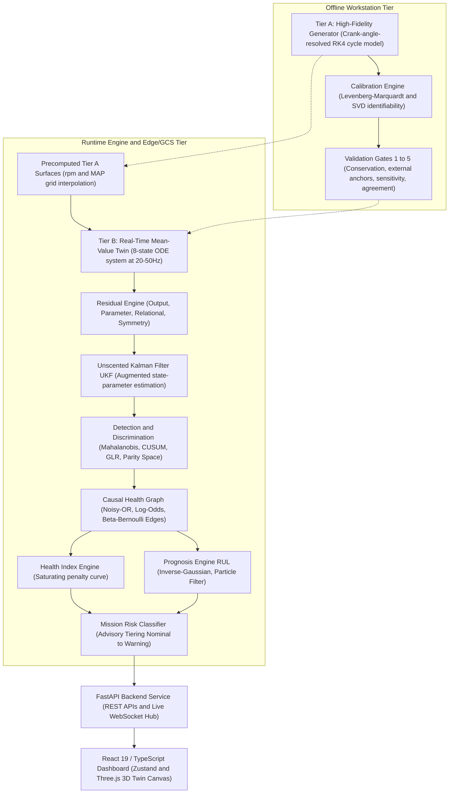
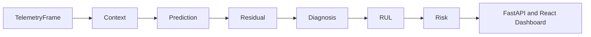

# System Architecture Overview

## Executive Summary

**Celestia (SIH26054)** is a physics-grounded digital twin and condition-monitoring platform for MALE (Medium-Altitude Long-Endurance) UAV aero piston engines (specifically targeting Rotax 914-class turbocharged engines). 

The platform bridges thermodynamic cycle modeling, real-time mean-value state estimation, Bayesian causal reasoning, remaining-useful-life (RUL) prognosis, and WebSocket-driven telemetry visualization.

---

## High-Level Architecture

The system operates across three tiers in a production deployment, mapped to a unified execution stack in this reference implementation:

---

## Core Tier Definitions

### 1. Tier A — Crank-Angle-Resolved Generator
- **Location**: [`simengine/engine/`](file:///home/dushyant/uav-engine-twin/simengine/engine)
- **Fidelity**: 0.2° Crank Angle (CA) resolution using a custom explicit 4th-order Runge-Kutta (RK4) integrator.
- **Physics**: Piston kinematics (slider-crank), temperature-dependent gas properties (\(\gamma(T)\)), double-Wiebe combustion heat release, Woschni in-cylinder heat transfer, universal compressible orifice gas flow, and Chen-Flynn friction.
- **Role**: Precomputes high-accuracy lookup surfaces for Tier B and runs campaign simulations for fault validation.

### 2. Tier B — Real-Time Mean-Value Twin
- **Location**: [`simengine/twin/meanvalue.py`](file:///home/dushyant/uav-engine-twin/simengine/twin/meanvalue.py)
- **Fidelity**: 8-state mean-value ODE system running at 20–50 Hz.
- **States**:
  1. Intake manifold pressure (\(p_{\text{MAP}}\))
  2. Engine shaft speed (\(\omega_{\text{engine}}\))
  3. Turbocharger shaft speed (\(\omega_{\text{tc}}\))
  4. Cylinder head temperature (\(T_{\text{head}}\))
  5. Coolant temperature (\(T_{\text{coolant}}\))
  6. Oil temperature (\(T_{\text{oil}}\))
  7. Cylinder liner temperature (\(T_{\text{liner}}\))
  8. Main gallery oil pressure (\(p_{\text{oil}}\))
- **Role**: Real-time reference execution model. Evaluates instantaneous expectations by interpolating precomputed Tier A surfaces.

### 3. Edge / Sensor & Condition Monitoring Stack
- **Location**: [`simengine/twin/`](file:///home/dushyant/uav-engine-twin/simengine/twin)
- **Components**:
  - **Residual Generation** ([`residual.py`](file:///home/dushyant/uav-engine-twin/simengine/twin/residual.py)): Output, parameter, relational, and symmetry residual calculation.
  - **UKF Estimator** ([`estimator.py`](file:///home/dushyant/uav-engine-twin/simengine/twin/estimator.py)): Dual state-parameter estimator over augmented vector \(\mathbf{x}^a = [\mathbf{x}; \boldsymbol{\theta}]\).
  - **Discriminator** ([`discriminator.py`](file:///home/dushyant/uav-engine-twin/simengine/twin/discriminator.py)): Parity space projection separating sensor faults from physical engine faults.
  - **Causal Graph** ([`graph.py`](file:///home/dushyant/uav-engine-twin/simengine/twin/graph.py)): Physics-informed DAG driving log-odds root-cause ranking.
  - **Health Index & RUL** ([`health_index.py`](file:///home/dushyant/uav-engine-twin/simengine/twin/health_index.py), [`rul.py`](file:///home/dushyant/uav-engine-twin/simengine/twin/rul.py)): First-passage Wald distribution / particle filter prognostics.

---

## Strict Advisory Constraint

> [!IMPORTANT]
> **Safety & Command Boundary**:
> The system operates under a hard architectural constraint: **the software only ever recommends; it NEVER issues actuator or control commands.**
> 
> All risk classifications, advisory tiers (`Nominal`, `Watch`, `Advisory`, `Caution`, `Warning`), and counterfactual projections return advisory guidance to human flight operators (`authority = "crew decides"`).

---

## Telemetry Pipeline Flow

The execution pipeline follows a linear data contract chain ([`simengine/twin/contracts.py`](file:///home/dushyant/uav-engine-twin/simengine/twin/contracts.py)):

$$\text{TelemetryFrame} \xrightarrow{} \text{Context} \xrightarrow{} \text{Prediction} \xrightarrow{} \text{Residual} \xrightarrow{} \text{Diagnosis} \xrightarrow{} \text{RUL} \xrightarrow{} \text{Risk}$$

