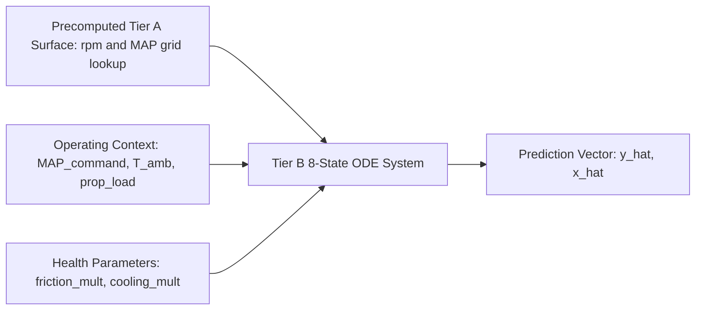
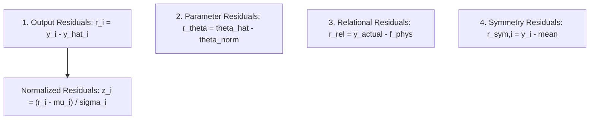

# Real-Time Twin & State Estimation Specification

## Overview

This document specifies the **Tier B Mean-Value Digital Twin** ([`simengine/twin/meanvalue.py`](file:///home/dushyant/uav-engine-twin/simengine/twin/meanvalue.py)), the **Residual Engine** ([`simengine/twin/residual.py`](file:///home/dushyant/uav-engine-twin/simengine/twin/residual.py)), and the **Unscented Kalman Filter (UKF)** state estimator ([`simengine/twin/estimator.py`](file:///home/dushyant/uav-engine-twin/simengine/twin/estimator.py)).

---

## Tier B Mean-Value Digital Twin Architecture

Unlike Tier A, which integrates crank-angle thermodynamics at sub-degree resolution, Tier B runs at **20–50 Hz** using precomputed Tier A surfaces.

### 1. Precomputed Surface Interpolation
Class `TierASurface` precomputes a grid across engine speeds (4500–6200 RPM) and manifold pressures (0.8–1.45 bar):

$$(\text{IMEP}, p_{\max}, T_{\text{evo}}) = f_{\text{TierA}}(\text{RPM}, p_{\text{MAP}})$$

Bivariate spline interpolation (`RegularGridInterpolator`) provides instantaneous cycle values without executing full crank-angle RK4 loops.

### 2. Tier B 8-State ODE Formulation

$$\frac{d p_{\text{MAP}}}{dt} = \frac{R_g T_i}{V_{\text{manifold}}} \left( \dot{m}_{\text{comp}} - \dot{m}_{\text{eng}} \right)$$

$$\frac{d \omega_{\text{engine}}}{dt} = \frac{T_b(\text{BMEP}) - \frac{T_{\text{prop}}}{i \cdot \eta_g}}{J_{\text{eff}}}$$

$$\frac{d \omega_{\text{tc}}}{dt} = \frac{\omega_{\text{tc,target}}(p_{\text{MAP}} / p_{\text{amb}}) - \omega_{\text{tc}}}{\tau_{\text{tc}}}$$

$$\begin{bmatrix} 
\frac{d T_{\text{head}}}{dt} \\
\frac{d T_{\text{coolant}}}{dt} \\
\frac{d T_{\text{oil}}}{dt} \\
\frac{d T_{\text{liner}}}{dt} 
\end{bmatrix} = \text{ThermalNetwork step}\left(\mathbf{T}, \dot{Q}_{\text{in}}, \mathbf{h}_{\text{ext}}\right)$$

$$\frac{d p_{\text{oil}}}{dt} = \frac{p_{\text{oil,ss}}(R_h, Q_{\text{pump}}) - p_{\text{oil}}}{\tau_{\text{oil}}}$$

---

## Four-Dimensional Residual Engine

Module: [`simengine/twin/residual.py`](file:///home/dushyant/uav-engine-twin/simengine/twin/residual.py)

Residuals replace arbitrary threshold alerts with statistically normalized error bounds:

### 1. Output Residuals
Direct difference between sensor telemetry and twin predictions:

$$r_i(t) = y_i(t) - \hat{y}_i(t)$$

### 2. Normalized Residuals
Context-surface z-scores indexed by scalar operating context \(u\) (e.g. throttle, altitude):

$$z_i(t) = \frac{r_i(t) - \mu_i(u)}{\sigma_i(u)}$$

### 3. Parameter Residuals
Difference between UKF-estimated health parameters \(\hat{\boldsymbol{\theta}}\) and nominal baselines:

$$\mathbf{r}_{\theta} = \hat{\boldsymbol{\theta}} - \boldsymbol{\theta}_{\text{nominal}}$$

### 4. Symmetry Residuals
Cylinder-to-cylinder deviation from mean (independent of twin model errors):

$$r_{\text{sym},i} = y_i - \frac{1}{N_{\text{cyl}}} \sum_{j=1}^{N_{\text{cyl}}} y_j$$

---

## Unscented Kalman Filter (UKF) Estimator

Module: [`simengine/twin/estimator.py`](file:///home/dushyant/uav-engine-twin/simengine/twin/estimator.py)

The UKF estimates both physical states \(\mathbf{x}\) and slowly-varying health parameters \(\boldsymbol{\theta}\) over an augmented state vector \(\mathbf{x}^a = [\mathbf{x}; \boldsymbol{\theta}] \in \mathbb{R}^n\).

### 1. Sigma-Point Generation (Scaled Unscented Transform)
Generates \(2n + 1\) sigma points:

$$\lambda = \alpha^2 (n + \kappa) - n$$

$$\chi_0 = \hat{\mathbf{x}}^a, \quad \chi_i = \hat{\mathbf{x}}^a + \left( \sqrt{(n + \lambda) \mathbf{P}} \right)_i, \quad \chi_{n+i} = \hat{\mathbf{x}}^a - \left( \sqrt{(n + \lambda) \mathbf{P}} \right)_i$$

$$W_m^{(0)} = \frac{\lambda}{n + \lambda}, \quad W_c^{(0)} = \frac{\lambda}{n + \lambda} + (1 - \alpha^2 + \beta)$$

$$W_m^{(i)} = W_c^{(i)} = \frac{1}{2(n + \lambda)} \quad (i = 1, \dots, 2n)$$

Defaults: \(\alpha = 10^{-3}\), \(\beta = 2.0\), \(\kappa = 0\).

### 2. Time & Measurement Update
1. **Propagate Sigma Points**: \(\chi_{i,k|k-1} = f(\chi_{i,k-1}, u_{k-1})\)
2. **Prior Mean & Covariance**:
   $$\hat{\mathbf{x}}_{k|k-1} = \sum W_m^{(i)} \chi_{i,k|k-1}$$
   $$\mathbf{P}_{k|k-1} = \mathbf{Q} + \sum W_c^{(i)} (\chi_{i,k|k-1} - \hat{\mathbf{x}}_{k|k-1})(\chi_{i,k|k-1} - \hat{\mathbf{x}}_{k|k-1})^T$$
3. **Observation Sigma Points**: \(\mathcal{Y}_{i,k|k-1} = h(\chi_{i,k|k-1}, u_k)\)
4. **Kalman Gain & Correction**:
   $$\mathbf{K}_k = \mathbf{P}_{xy} \mathbf{P}_{yy}^{-1}$$
   $$\hat{\mathbf{x}}_k = \hat{\mathbf{x}}_{k|k-1} + \mathbf{K}_k (\mathbf{y}_k - \hat{\mathbf{y}}_k)$$
   $$\mathbf{P}_k = \mathbf{P}_{k|k-1} - \mathbf{K}_k \mathbf{P}_{yy} \mathbf{K}_k^T$$

---

## Parity Space Sensor-vs-Engine Discriminator

Module: [`simengine/twin/discriminator.py`](file:///home/dushyant/uav-engine-twin/simengine/twin/discriminator.py)

Separates sensor faults (e.g. frozen sensor, bias) from physical component degradation using parity matrices:

$$\mathbf{W} \cdot \mathbf{H}_x = \mathbf{0}$$

$$\mathbf{p}(t) = \mathbf{W} (\mathbf{Y} - \mathbf{H}_u \mathbf{U})$$

Suspicion cosine score for channel \(i\):

$$\cos(\psi_i) = \frac{\mathbf{p}^T (\mathbf{W} \mathbf{e}_i)}{\|\mathbf{p}\| \|\mathbf{W} \mathbf{e}_i\|}$$

- If \(\cos(\psi_i) \to 1.0\), fault trajectory aligns with single sensor perturbation \(\implies\) **Sensor Fault**.
- If energy/mass balance conditions are corroborated \(\implies\) **Physical Engine Fault**.
