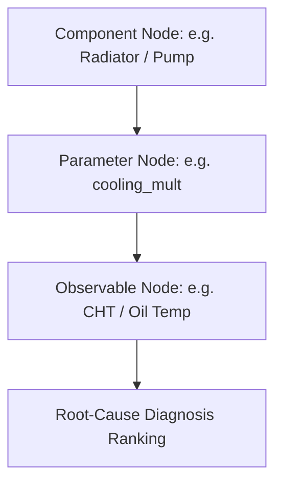

# Fault Diagnosis, Prognosis (RUL) & Mission Risk Specification

## Overview

This document details the condition monitoring stack ([`simengine/twin/`](file:///home/dushyant/uav-engine-twin/simengine/twin)):
1. **Fault Library & Detection Alarms**
2. **Causal Health Graph Inference**
3. **Health Index Calculation**
4. **Remaining Useful Life (RUL) Prognosis**
5. **Mission Risk & Advisory Classification**

---

## Fault Library (21 Modes)

Module: [`simengine/faults/library.py`](file:///home/dushyant/uav-engine-twin/simengine/faults/library.py), Config: [`simengine/config/fault_library.yaml`](file:///home/dushyant/uav-engine-twin/simengine/config/fault_library.yaml)

The fault engine models **21 physical fault modes** categorized across engine subsystems:

| Subsystem | Fault Name | Primary Parameter / Channel Affected |
|---|---|---|
| **Cooling** | `cooling_degradation` | Radiator heat transfer multiplier \(\eta_{\text{cool}} \downarrow\) |
| **Lubrication** | `oil_pump_wear` | Pump volumetric efficiency \(\eta_{\text{vol,pump}} \downarrow\) |
| **Lubrication** | `bearing_clearance_growth` | Bearing radial clearance \(c \uparrow\) |
| **Lubrication** | `gallery_blockage` | Hydraulic resistance \(R_h \uparrow\) |
| **Combustion** | `injector_fouling` | Fuel flow area / efficiency \(\eta_c \downarrow\) |
| **Combustion** | `spark_plug_foul` | Misfire / ignition timing jitter |
| **Combustion** | `ring_pack_wear` | Blow-by orifice area \(A_{\text{bb}} \uparrow\) |
| **Air / Turbo** | `air_filter_clog` | Intake pressure drop \(\Delta p_{\text{intake}} \uparrow\) |
| **Air / Turbo** | `intercooler_fouling` | Charge air heat transfer \(\eta_{\text{intercooler}} \downarrow\) |
| **Air / Turbo** | `wastegate_stuck` | Turbo wastegate position lock |
| **Sensors** | `map_sensor_bias` | Offset on MAP channel |
| **Sensors** | `cht_sensor_drift` | Drift on CHT channel |
| **Sensors** | `oil_press_frozen` | Zero-variance signal lock on \(p_{\text{oil}}\) |

---

## Causal Health Graph Inference

Module: [`simengine/twin/graph.py`](file:///home/dushyant/uav-engine-twin/simengine/twin/graph.py)

Root-cause diagnosis relies on a Directed Acyclic Graph (DAG) derived from physics, avoiding black-box correlation mining:

### 1. Noisy-OR Activation Probability
The probability that observable node \(e_i\) is activated by its parent causes \(j\):

$$P(e_i = 1 \mid \text{parents}) = 1 - \prod_{j \in \text{parents}} \left( 1 - p_{ij} \right)^{s_j}$$

where \(s_j\) is parent severity and \(p_{ij}\) is edge activation probability.

### 2. Log-Odds Evidence Accumulation
Posterior log-odds for hypothesis \(H_k\) given evidence LLRs:

$$\text{LogOdds}(H_k \mid \mathbf{E}) = \text{LogOdds}(H_k) + \sum_{m} \text{LLR}_m$$

$$\text{LLR}_m = \ln \left( \frac{P(E_m \mid H_k)}{P(E_m \mid H_0)} \right)$$

$$P(H_k \mid \mathbf{E}) = \sigma\left( \text{LogOdds}(H_k \mid \mathbf{E}) \right) = \frac{1}{1 + e^{-\text{LogOdds}}}$$

### 3. Beta-Bernoulli Conjugate Edge Learning
Edge confidence updates dynamically based on verified observations:

$$\text{Beta}(\alpha, \beta) \xrightarrow{\text{Effect observed}} \text{Beta}(\alpha + 1, \beta)$$

$$\text{Beta}(\alpha, \beta) \xrightarrow{\text{Effect missing}} \text{Beta}(\alpha, \beta + 1)$$

$$\text{Edge Gain } w_{ij} = \frac{\alpha}{\alpha + \beta}$$

---

## Health Index (HI) Engine

Module: [`simengine/twin/health_index.py`](file:///home/dushyant/uav-engine-twin/simengine/twin/health_index.py)

The Health Index provides a scalar score \([0, 100]\) that saturates under extreme single-channel outliers:

$$\phi(z_i) = 1 - \exp\left( -\left(\frac{|z_i|}{u_0}\right)^2 \right)$$

$$\text{HI}(t) = 100 \cdot \left( 1 - \sum_{i} \pi_i \phi(z_i(t)) \right)$$

where \(\pi_i\) are normalized channel weights derived from graph centrality \(\kappa_i\) and failure consequence severity \(c_i\):

$$\pi_i = \frac{c_i \kappa_i}{\sum_j c_j \kappa_j}$$

---

## Remaining Useful Life (RUL) Prognosis

Module: [`simengine/twin/rul.py`](file:///home/dushyant/uav-engine-twin/simengine/twin/rul.py)

Prognosis models degradation as a first-passage stochastic process to failure threshold \(D_{\text{th}}\):

$$dD(t) = \mu(u, D) dt + \sigma_D dW(t)$$

### 1. Inverse Gaussian (Wald) Closed-Form RUL
For constant drift \(\mu\), the time-to-failure PDF follows the Wald distribution:

$$f_{\text{RUL}}(t) = \frac{D_{\text{th}} - D_0}{\sigma_D \sqrt{2\pi t^3}} \exp\left( -\frac{\left( (D_{\text{th}} - D_0) - \mu t \right)^2}{2 \sigma_D^2 t} \right)$$

### 2. Particle Filter Prognosis
For non-Gaussian / nonlinear degradation, \(N_p = 1000\) particles are propagated:

$$D_{i, k+1} = D_{i, k} + \mu(D_{i,k}) \Delta t + \sigma_D \sqrt{\Delta t} \, \epsilon_{i,k}$$

Empirical quantile crossing times yield RUL percentiles: \(q_{05}\) (pessimistic planning bound), \(q_{50}\) (median), \(q_{95}\) (optimistic).

### 3. Engine-Level Aggregation
Engine-level RUL is the strict minimum across all components:

$$\text{RUL}_{\text{engine}}(q) = \min_{j \in \text{components}} \text{RUL}_j(q)$$

---

## Mission Risk & Advisory Classification

Module: [`simengine/twin/mission_risk.py`](file:///home/dushyant/uav-engine-twin/simengine/twin/mission_risk.py)

### 1. Mission Survival Probability

$$P_{\text{success}} = \exp\left( -\int_{0}^{T_{\text{mission}}} \lambda(t) \, dt \right)$$

### 2. Advisory Tier Classifier Matrix

> [!IMPORTANT]
> Non-Command Principle: Authority is strictly `crew decides`.

| Advisory Tier | Trigger Condition | Display Action | Authority |
|---|---|---|---|
| **Warning** | Cascade projected to exceed limit OR Knock / Oil pressure fault | Immediate recommended action with physical reasoning | Crew decides |
| **Caution** | Concurrence confirmed AND \(q_{05}(\text{RUL}) < T_{\text{mission}}\) | Projected exceedance time + counterfactual options | Crew decides |
| **Advisory** | Concurrence confirmed AND \(q_{05}(\text{RUL}) \ge T_{\text{mission}}\) | Ranked root cause + recommended setting change | Crew decides |
| **Watch** | Persistent residual detected without multi-channel cascade | Channel drift indicator; no immediate action | None |
| **Nominal** | \(\text{HI} > 90\) and zero residual alarms | Health trend normal | None |
