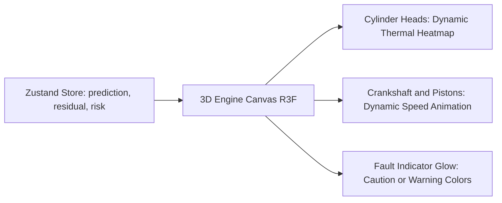

# Frontend Dashboard System Guide

## Overview

The **Frontend Dashboard** ([`frontend/`](file:///home/dushyant/uav-engine-twin/frontend)) is built with **React 19**, **strict TypeScript**, **Vite**, **Tailwind CSS**, **Zustand**, and **Three.js / React Three Fiber (R3F)**.

The frontend has **zero mock mode**: every dashboard component is driven dynamically by real telemetry streaming from the FastAPI backend over a live WebSocket (`/ws/telemetry`).

---

## State Management (`useEngineStore`)

Module: [`frontend/src/store/useEngineStore.ts`](file:///home/dushyant/uav-engine-twin/frontend/src/store/useEngineStore.ts)

State is managed via Zustand. The client maintains a rolling window buffer of the last 300 telemetry frames (`HISTORY_LIMIT = 300`) for real-time charting.

```typescript
interface EngineStoreState {
  connected: boolean;
  lastUpdatedAt: number | null;
  prediction: Prediction | null;
  residual: Residual | null;
  diagnosis: Diagnosis | null;
  rul: RUL | null;
  risk: Risk | null;
  history: PipelineResult[];
  connect: () => void;
  disconnect: () => void;
}
```

---

## 3D Engine Twin Canvas

Module: [`frontend/src/Components/twin/`](file:///home/dushyant/uav-engine-twin/frontend/src/Components/twin)

The 3D Engine Twin renders a dynamic WebGL model of the 4-cylinder engine using `@react-three/fiber` and `@react-three/drei`.



### Visual Behaviors
1. **Piston Motion**: Crankshaft and piston displacement animate in sync with live `omega_engine_rad_s` from predictions.
2. **Thermal Heatmaps**: Cylinder heads transition from nominal blue/cyan to cautionary yellow/red based on predicted CHT (\(T_{\text{head}}\)) and residual offsets.
3. **Twin belief vs. Sensor residual**: The 3D twin explicitly renders the **twin's own belief state** (predicted temperature), while diagnostic cards highlight residual deviations.

---

## Dashboard Pages & Modules

### 1. Main Dashboard (`Dashboard.tsx`)
- **Executive Summary Header**: Live Health Index (100–0), Advisory Tier badge (`Nominal`, `Watch`, `Advisory`, `Caution`, `Warning`), and mission survival probability.
- **Twin Canvas & KPI Cards**: 3D interactive view alongside primary telemetry metrics (RPM, MAP, CHT, EGT, Oil Press, Oil Temp).
- **Diagnosis Panel**: Top ranked root-cause hypotheses with confidence percentages and supporting evidence statements.

### 2. Virtual Twin (`VirtualTwin.tsx`)
- Fullscreen 3D engine inspection canvas with interactive orbit controls, component isolate toggles, and temperature overlay controls.

### 3. Health & Condition Monitoring (`Health.tsx`)
- Subsystem health index breakdowns (Combustion, Cooling, Lubrication, Air/Boost).
- Residual heatmap matrix displaying normalized z-scores across all active sensor channels.

### 4. Mission Control & Prognosis (`MissionControl.tsx`)
- RUL first-passage probability distribution curve.
- Mission survival curve over planned flight duration.
- Advisory action card displaying operator recommendations.

### 5. Flight Simulation (`FlightSimulation.tsx`)
- Interactive flight profile runner (Takeoff \(\to\) Climb \(\to\) Cruise \(\to\) Descent \(\to\) Landing).
- Fault injector panel allowing real-time injection of failure modes during live flight.

---

## Styling & Theme System

- **Dark Mode Palette**: Deep slate/charcoal background (`#0B0F17`), glassmorphism card surfaces, and high-contrast typography.
- **Status Color Code**:
  - `Nominal`: Emerald / Cyan (`#10B981`, `#06B6D4`)
  - `Watch`: Blue (`#3B82F6`)
  - `Advisory`: Yellow (`#EAB308`)
  - `Caution`: Orange (`#F97316`)
  - `Warning`: Red (`#EF4444`)
