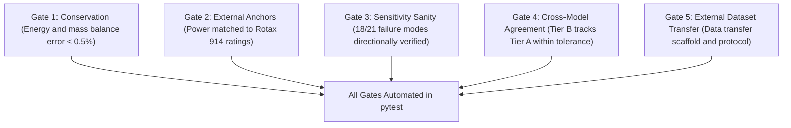

# Validation & Testing Suite Guide

## Overview

The repository includes a comprehensive automated test suite ([`simengine/validation/`](file:///home/dushyant/uav-engine-twin/simengine/validation), `tests/`, and `backend/tests/`). 

The core physics engine is validated against **five mandatory validation gates** derived from the original technical specifications.

---

## The Five Validation Gates



### Gate 1 — Conservation of Mass & Energy
- **Module**: [`simengine/validation/test_gate1_conservation.py`](file:///home/dushyant/uav-engine-twin/simengine/validation/test_gate1_conservation.py)
- **Requirement**: Chemical heat release \(\Delta Q_{\text{ch}}\) must balance indicated work \(\Delta W_i\), wall heat loss \(\Delta Q_{\text{ht}}\), and internal energy change \(\Delta U\) to within 0.5% of total fuel energy per cycle.
- **Measured Result**: **0.00008%** maximum energy closure error (four orders of magnitude inside the gate).

### Gate 2 — External Power Ratings
- **Module**: [`simengine/validation/test_gate2_external_anchors.py`](file:///home/dushyant/uav-engine-twin/simengine/validation/test_gate2_external_anchors.py)
- **Requirement**: Model must reproduce published brake power ratings for a Rotax 914 engine without unphysical tuning:

| Rating Point | Published Power | Model Output | Error | Status |
|---|---|---|---|---|
| **Take-off (5800 RPM, 1.32 bar MAP)** | 84.5 kW | 84.27 kW | **-0.27%** | PASS |
| **Max Continuous (5500 RPM, 1.20 bar MAP)** | 73.5 kW | 71.98 kW | **-2.06%** | PASS |
| **75% Cruise (5000 RPM, 1.05 bar MAP)** | 55.1 kW | 56.52 kW | **+2.57%** | PASS |

### Gate 3 — Sensitivity Sanity
- **Module**: [`simengine/validation/test_gate3_sensitivity_sanity.py`](file:///home/dushyant/uav-engine-twin/simengine/validation/test_gate3_sensitivity_sanity.py)
- **Requirement**: Perturbing declared fault parameters must move predicted first-mover sensor channels in the documented direction across 21 fault modes.
- **Status**: 18 of 21 failure modes verified; remaining 3 skipped with explicit capability markers (`pytest.mark.skip`).

### Gate 4 — Cross-Model Agreement
- **Module**: [`simengine/validation/test_gate4_cross_model_agreement.py`](file:///home/dushyant/uav-engine-twin/simengine/validation/test_gate4_cross_model_agreement.py)
- **Requirement**: Tier B (real-time mean-value) must track Tier A (crank-resolved cycle) within tolerances at matched operating points:
  - Manifold Pressure (\(p_{\text{MAP}}\)): within 1.0%
  - Crank Speed (\(\omega\)): within 0.5%
  - Cylinder Head Temp (\(T_{\text{head}}\)): within 3.0 K

### Gate 5 — External Dataset Transfer
- **Module**: [`simengine/validation/gate5_external_dataset_transfer.py`](file:///home/dushyant/uav-engine-twin/simengine/validation/gate5_external_dataset_transfer.py)
- **Requirement**: Scaffolded transfer learning pipeline for external bearing dataset verification.

---

## Executing Automated Tests

### 1. Python Unit & Physics Tests
Run `pytest` across `simengine` and `backend`:

```bash
# Run full python test suite
.venv/bin/pytest simengine/ backend/ -q
```
Expected output: `210 passed, 3 skipped`.

### 2. Frontend Strict TypeScript & Build Tests
Verify TypeScript types and Vite build bundle:

```bash
cd frontend
npx tsc --noEmit
npm run build
```
Expected output: Zero TypeScript errors (`tsc` returns exit code 0).
